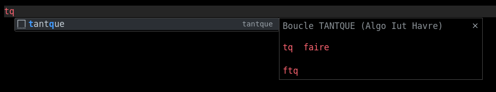
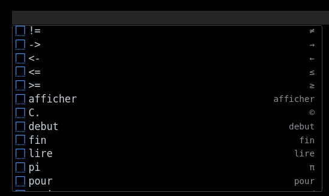

# Algo README

### Coloration Syntaxique

### Prise en charge des fichiers .algo

## Ajout de La syntaxe d'ecriture pour le pseudo code

- Utilisation : 

### Utilisation dans le `ctrl + espace`
Transforme par exemple le <= en ≤

