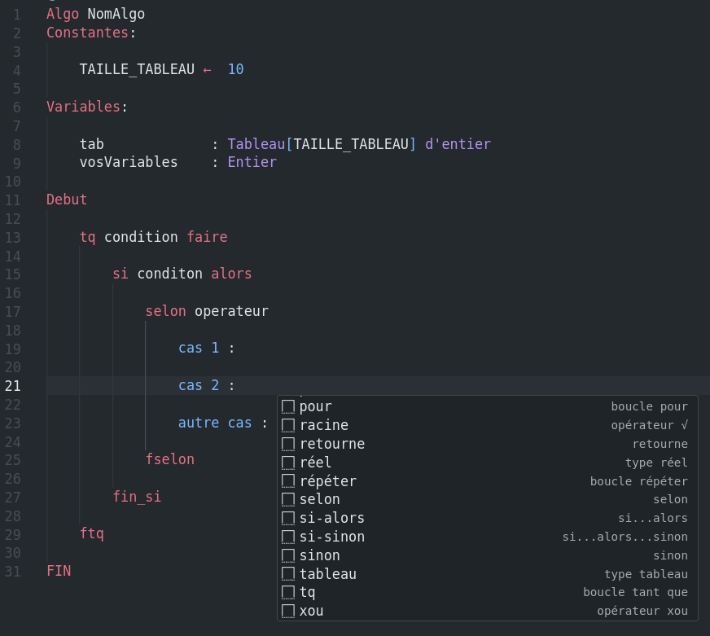

# Algo Iut Havre

## Coloration Syntaxique et prise en charge des fichiers .algo

# Documentation de l'extension :

Cette extension pour Visual Studio Code vous permet de travailler plus efficacement avec du pseudo-code en fournissant des préfixes pour des structures de contrôle, des opérateurs, des types de données, et d'autres éléments utiles pour le pseudocode. Voici une liste des préfixes disponibles et de leurs descriptions :

## Structures de contrôle

### 1. Algorithme
**Préfixe :** "Algo"
**Description :** Structure de base d'un algorithme pseudo-code.

### 2. Selon
**Préfixe :** "selon"
**Description :** Structure de contrôle de cas multiple.

### 3. Boucle Pour
**Préfixe :** "pour"
**Description :** Boucle de répétition avec une variable d'itération.

### 4. Si...Alors
**Préfixe :** "si-alors"
**Description :** Structure de contrôle conditionnelle.

### 5. Si...Alors...Sinon
**Préfixe :** "si-sinon"
**Description :** Structure de contrôle conditionnelle avec une clause "sinon".

### 6. Boucle Tant Que
**Préfixe :** "tq"
**Description :** Boucle de répétition basée sur une condition.

### 7. Boucle Répéter
**Préfixe :** "répéter"
**Description :** Boucle de répétition 

## Mots-clés

### 8. Debut
**Préfixe :** "debut"
**Description :** Marque le début d'un bloc d'instructions.

### 9. Faire
**Préfixe :** "faire"
**Description :** Utilisé pour indiquer le début du corps de la structure de contrôle.

### 10. Fin
**Préfixe :** "fin"
**Description :** Marque la fin d'un bloc d'instructions.

### 11. Fin_Pour
**Préfixe :** "fin_pour"
**Description :** Marque la fin d'une boucle "Pour".

### 12. Fin_Si
**Préfixe :** "fin_si"
**Description :** Marque la fin de la structure "Si...Alors".

### 13. Ftq
**Préfixe :** "ftq"
**Description :** Marque la fin d'une boucle "Tant Que".

### 14. Jusqu'à
**Préfixe :** "jusqu'à"
**Description :** Utilisé pour spécifier la condition de sortie d'une boucle "Répéter".

## Entrées/Sorties

### 15. Lire()
**Préfixe :** "lire"
**Description :** Lit une valeur depuis l'entrée standard.

### 16. Fonction Ord()
**Préfixe :** "ord"
**Description :** Utilisé pour obtenir la valeur ASCII d'un caractère.

### 17. Fonction Car()
**Préfixe :** "car"
**Description :** Utilisé pour obtenir un caractère à partir de son code ASCII.

### 18. Écrire()
**Préfixe :** "écrire"
**Description :** Utilisé pour afficher une expression.

## Types de données

### 19. Type Booléen
**Préfixe :** "booléen"
**Description :** Définit un type de donnée booléen.

### 20. Type Caractère
**Préfixe :** "caractère"
**Description :** Définit un type de donnée caractère.

### 21. Type Chaîne
**Préfixe :** "chaîne"
**Description :** Définit un type de donnée chaîne.

### 22. Type Entier
**Préfixe :** "entier"
**Description :** Définit un type de donnée entier.

### 23. Type Réel
**Préfixe :** "réel"
**Description :** Définit un type de donnée réel.

### 24. Type Tableau
**Préfixe :** "tableau"
**Description :** Définit un tableau avec une taille et un type.

## Opérateurs

### 25. Opérateur ≥
**Préfixe :** ">="
**Description :** L'opérateur "plus grand ou égal à".

### 26. Opérateur ≤
**Préfixe :** "<="
**Description :** L'opérateur "plus petit ou égal à".

### 27. Opérateur ≠
**Préfixe :** "!="
**Description :** L'opérateur "différent de".

### 28. Opérateur √
**Préfixe :** "racine"
**Description :** L'opérateur "racine carrée".

### 29. →
**Préfixe :** "->"
**Description :** La flèche droite.

### 30. π
**Préfixe :** "pi"
**Description :** Pi.

### 31. ©
**Préfixe :** "C."
**Description :** Le copyright.

### 32. •
**Préfixe :** "."
**Description :** Le point médian.

### 33. ±
**Préfixe :** "+-"
**Description :** Le symbole "plus ou moins".

### 34. Affectation (<--)
**Préfixe :** "<--"
**Description :** L'opérateur d'affectation.

## Opérateurs logiques

### 35. Opérateur Et
**Préfixe :** "et"
**Description :** Opérateur logique "et".

### 36. Opérateur Xou
**Préfixe :** "xou"
**Description :** Opérateur logique "ou exclusif".

### 37. Opérateur Ou
**Préfixe :** "ou"
**Description :** Opérateur logique "ou".

### 38. Opérateur Non
**Préfixe :** "non"
**Description :** Opérateur logique "non".

### 39. Opérateur Div
**Préfixe :** "div"
**Description :** Opérateur de division entière.

### 40. Opérateur Mod
**Préfixe :** "mod"
**Description :** Opérateur de modulo.

- Ces préfixes et structures de contrôle vous aideront à écrire du pseudo-code de manière plus efficace et organisée dans Visual Studio Code.
